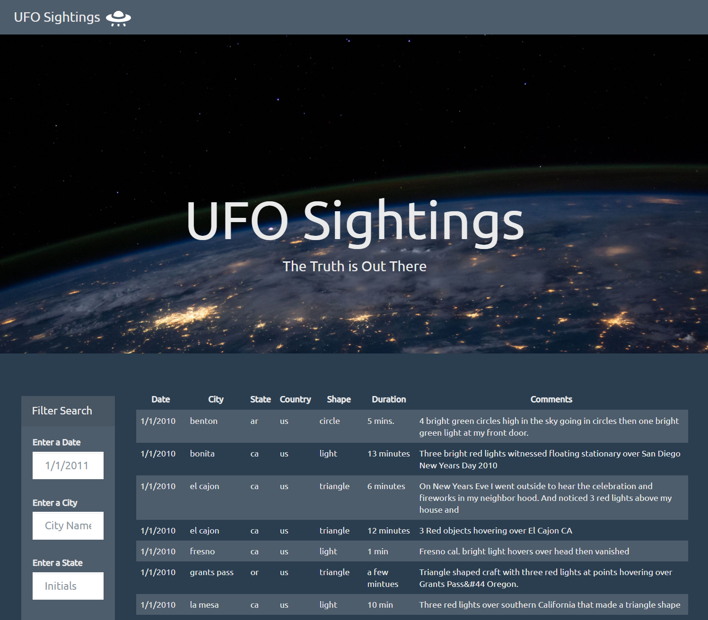
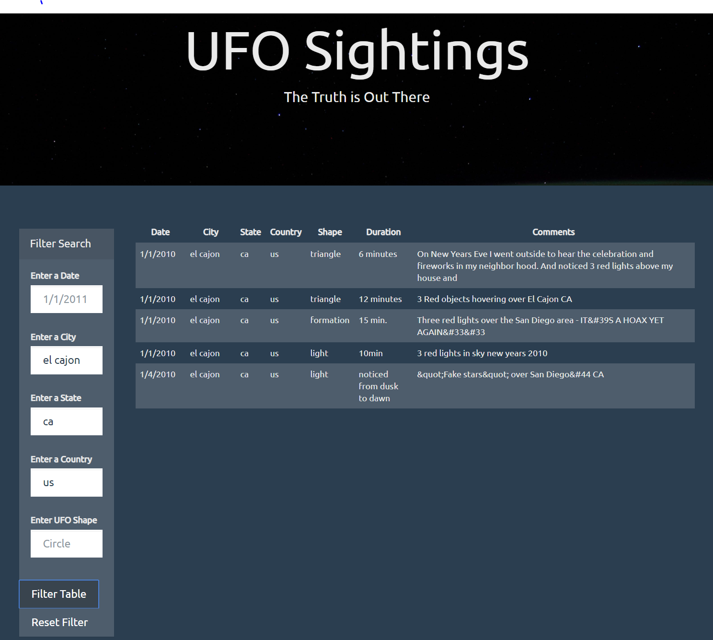

# HW13 - JavaScript and DOM Manipulation

## Level 1: Automatic Table and Date Search

Using the UFO dataset provided in the form of an array of JavaScript objects, write code that appends a table to your web page and then adds new rows of data for each UFO sighting.

```javascript
// Variable looking at the file data.js
var tableData = data;

// Select the HTML tag that will display the data
var tbody = d3.select("tbody");


    // Remove the pre-loaded data from the existing table
    tbody.html("");

// Iterate through the data.js and append it to the table tag <tbody>
// Using Arrow Functions
    dataset.forEach((tableData) => {
        var row = tbody.append("tr");
        Object.entries(tableData).forEach(([key, value]) => {
            var cell = row.append("td");
            cell.text(value);
        });
    });

}

// Render the table with all data from data.js
appendRows(tableData);
```




Use a date form in your HTML document and write JavaScript code that will listen for events and search through the date/time column to find rows that match user input.

```javascript
var submit = d3.select("#filter-btn");

// Event listener on click
submit.on("click", function() {

    // Prevent the page from refreshing
    d3.event.preventDefault();

    // LEVEL 1: This filter is used for date/time only
    // Select the input element and get the raw HTML node
    var ufoDate = d3.select("#datetime").property("value");
    var filteredData = tableData.filter(result => result.datetime === ufoDate);
```

End of Level 1

## Level 2: Multiple Search Categories 

Using multiple input tags and/or select dropdowns, write JavaScript code so the user can to set multiple filters and search for UFO sightings using the following criteria based on the table columns:

* date/time
* city
* state
* country
* shape


```javascript
var submit = d3.select("#filter-btn");

// Event listener on click
submit.on("click", function() {

    // Prevent the page from refreshing
    d3.event.preventDefault();

    // LEVEL 2
    // Filter for all 5 conditions
    // Create variables for all the different filtering conditions

    var ufoDate = d3.select("#datetime").property("value").trim().toLowerCase();
    var ufoCity = d3.select("#city").property("value").trim().toLowerCase();
    var ufoState = d3.select("#state").property("value").trim().toLowerCase();
    var ufoCountry = d3.select("#country").property("value").trim().toLowerCase();
    var ufoShape = d3.select("#shape").property("value").trim().toLowerCase();


    //Filter method creating separate and combined arrays for the input fields
    var filteredData = tableData.filter(result => {
        var dateMatches = result.datetime === ufoDate || ! ufoDate;
        var cityMatches = result.city === ufoCity || ! ufoCity;
        var stateMatches = result.state === ufoState || ! ufoState;
        var countryMatches = result.country === ufoCountry || ! ufoCountry;
        var shapeMatches = result.shape === ufoShape || ! ufoShape;
        return dateMatches && cityMatches && stateMatches && countryMatches && shapeMatches;

    });

    // // return filteredData;
    // console.log(filteredData);
    appendRows(filteredData);

});
```



End of Homework RMJ
